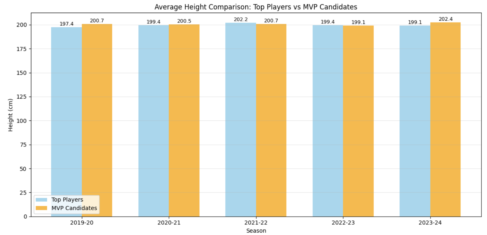
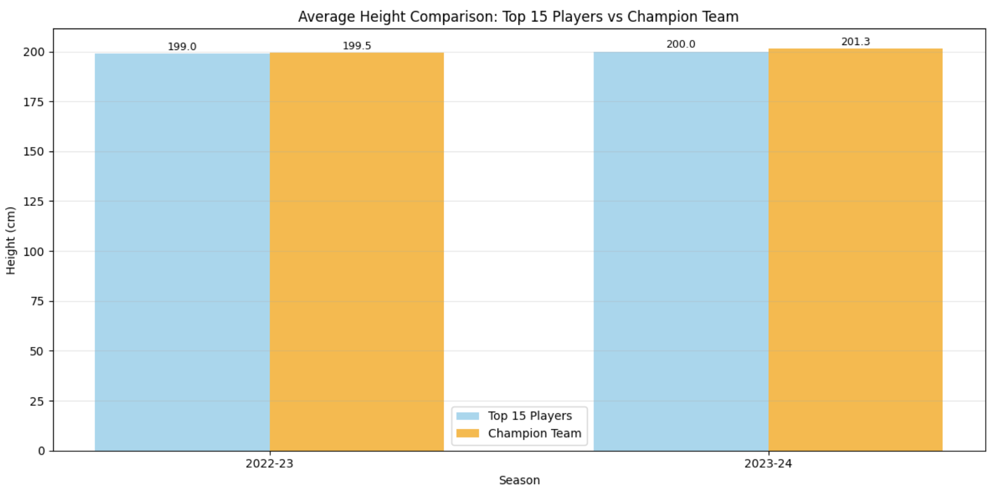
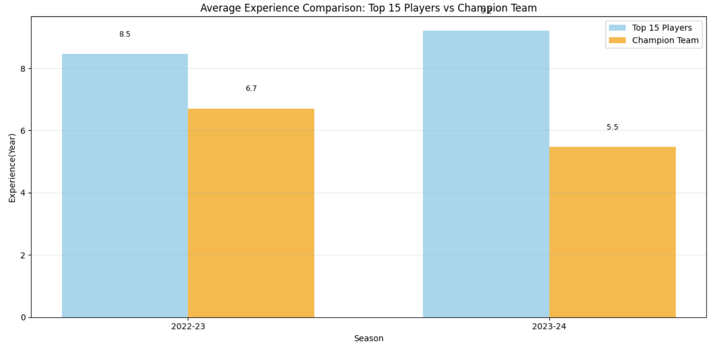
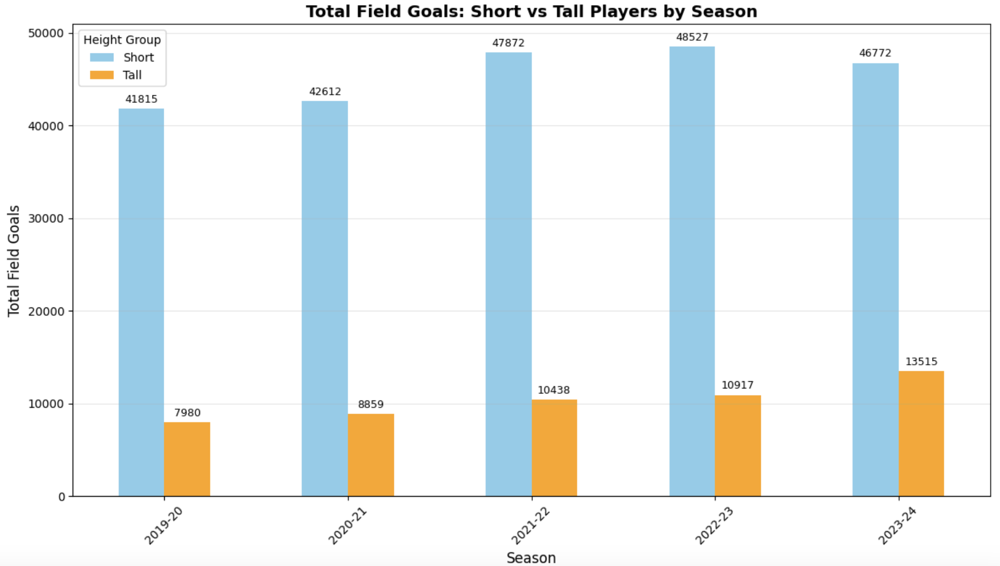
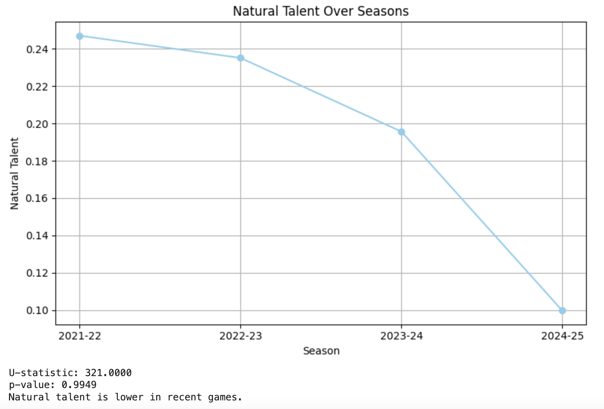
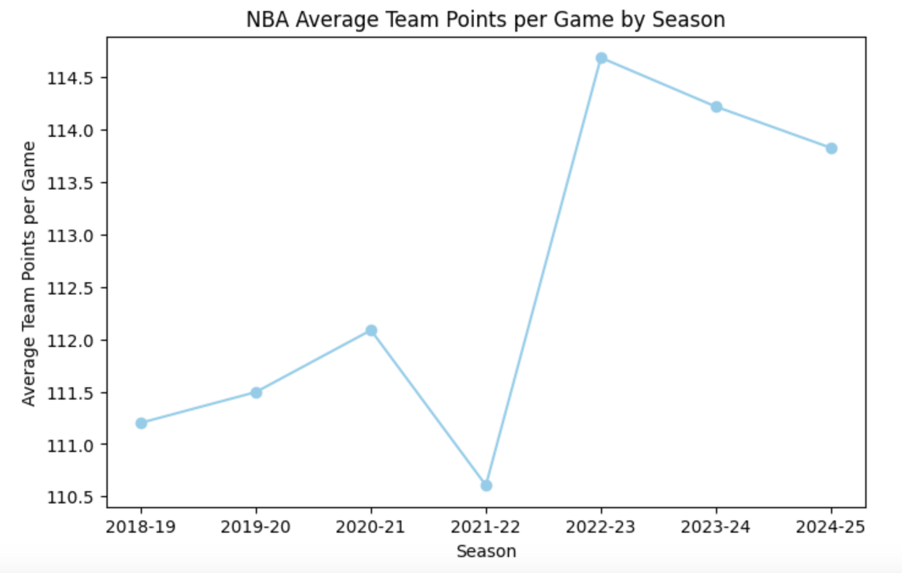
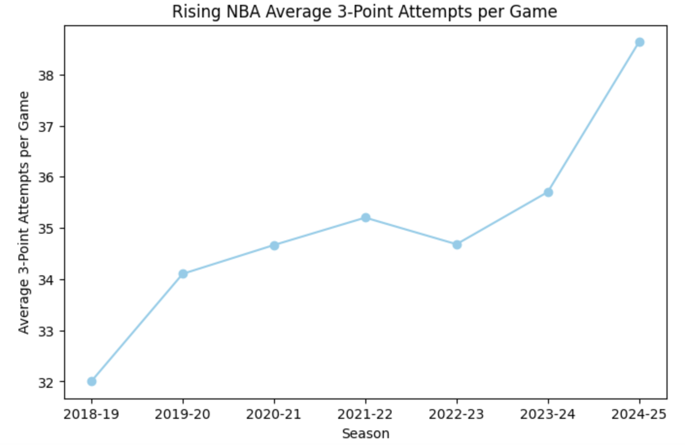
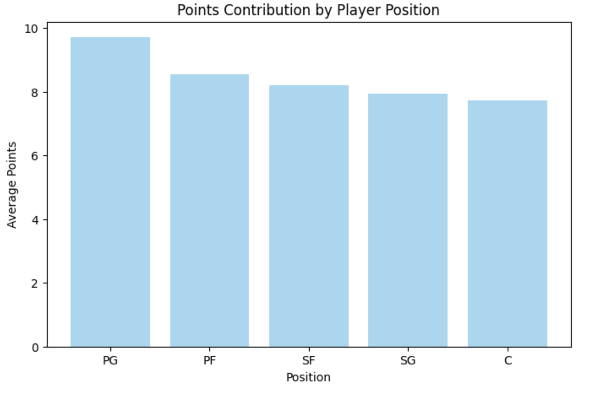
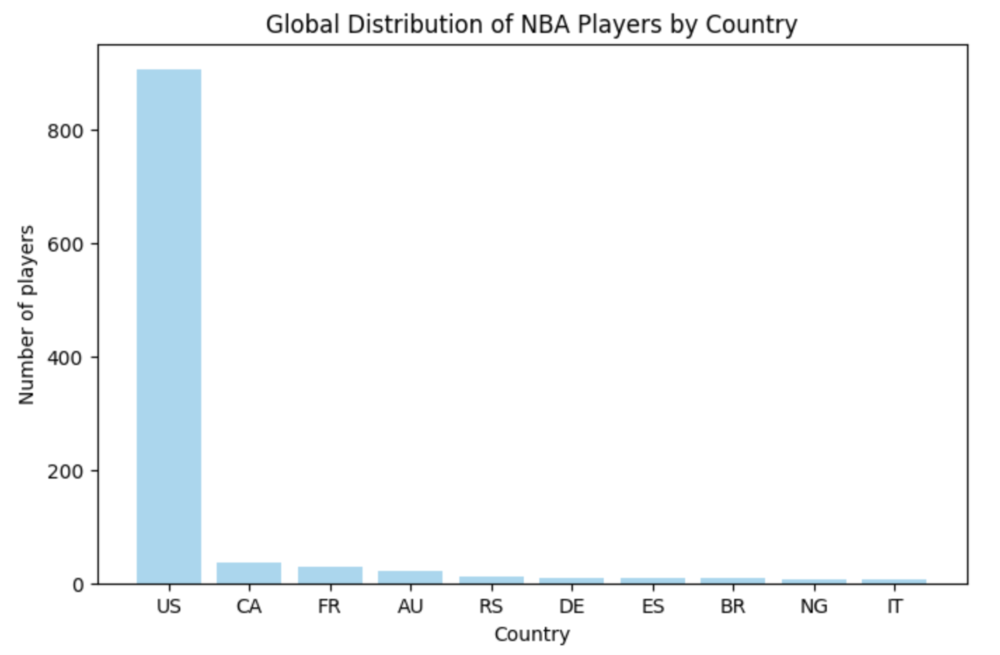

# Basketball Reference Statistical Analysis

Basketball Reference Statistical Analysis
  

  Website : http://basketball-reference.com/
  

Some Results :
  

  

  
  

  

  
    
  

  

  
    
  

  

  
    
  

  

  
    
  

  

  
    
  

  

  
    
  

  

  
    
  

  

  
    
  

  

